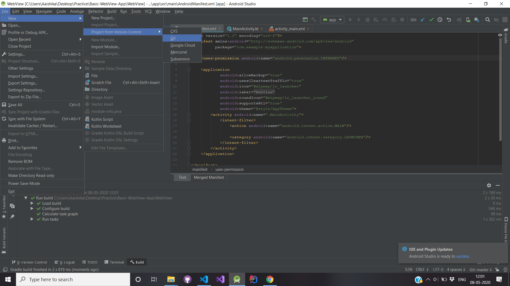
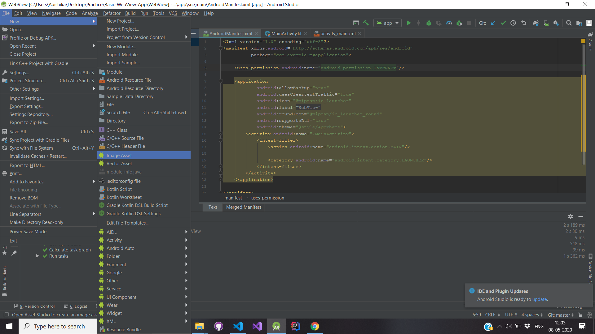

# Basic WebView App

  
A WebView is an embeddable browser that a native application can use to display web content. There are a two sets of words to highlight here: The first set of words is native application (aka app). The Webview App that we have here is built in Kotlin, which is a cross-platform, statically typed, general-purpose programming language with type inference. Kotlin is designed to interoperate fully with Java, and the JVM version.

## Create your Webview with this Repository

- Clone this Repository.
- ALL files are present in this Repository.
- Use Android Studio to open the folder cloned.
  

## Amendments

- You need to make amends to 3 Files:
  - MainActivity.kt
  - Activity_Main.xml
  - AndroidManifest.xml
- Following are the changes that you need to implement:
  - Change the Package Name (Optional if you don't intend on Publishing the App)
  - Change the App Icon (Explained in detail).
  - Change the text or remove it from this section in Activity_Main.xml:
  `<TextView
            android:text="Add Text Here"  
            android:gravity="center"  
            android:padding="20sp"  
            android:layout_width="match_parent"  
            android:layout_height="wrap_content"/>`
  - Most importantly, Update the URL of the webview in MainActivity.kt, linked in this specific line:
  `webView.loadUrl("URL")`
 
 ## Change App Icon
 
 Follow these steps to change the App Icon:
 
  
1. Create PNG image file of size 512x512 pixels
2. In Android Studio, in project view, highlight a mipmap directory
3. In menu, go to File>New>Image Asset
4. Click Image Button in Asset type button row
5. Click on 3 Dot Box at right of Path Box.
6. Drag image to source asset box
7. Click Next (Note: Existing launcher files will be overwritten)
8. Click Finish

## Fixes

- Unless specified, you can't visit the previous page in the app without having to exit the app. This is quite annoying when it comes to websites that require login. The same has been fixed with the following line:
`override fun onBackPressed() =   
        if (webView != null && webView.canGoBack()) webView.goBack() // if there is previous page this code opens it   
    else super.onBackPressed() //if there is no previous page, this line simply closes the app`
    
## Collaborators

- Aaishika S Bhattacharya
